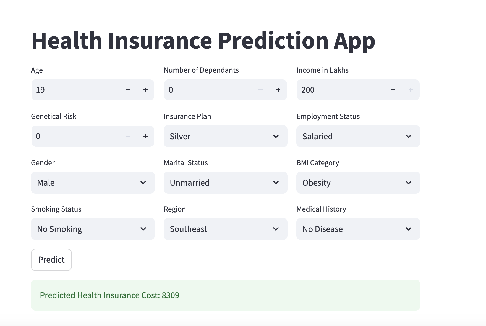

# MLProject-Premium-Prediction

##  Project Overview  
This project predicts health insurance premiums based on various features such as age, BMI, smoking status, and other health-related factors. The goal is to build an accurate machine-learning model that helps insurance companies estimate premiums efficiently.

##  Dataset Information  
The dataset contains the following features:  
- **age**: Age of the individual  
- **gender**: Male/Female  
- **region**: Geographic location of the individual -'Northwest' 'Southeast' 'Northeast' 'Southwest' 
- **marital_status**: Unmarried/Married  
- **number_of_dependants**: Count of dependents  
- **bmi_category**: Underweight/Normal/Overweight/Obesity 
- **smoking_status**: No Smoking/Regular/Occasional
- **employment_status**: Salaried/Freelancer/Self-Employed  
- **income_level**: <10L / 10L - 25L / >40L / 25L - 40L  
- **income_lakhs**: Income in lakhs (numerical value)  
- **medical_history**: Details of past medical conditions  
- **insurance_plan**: Type of insurance plan chosen - 'Bronze' /'Silver'/ 'Gold' 
- **annual_premium_amount**: Target variable (premium amount to be predicted)  

##  Project Setup  
### 1. Clone the Repository  
```bash
git clone https://github.com/neethu-codes/MLProject-Premium-Prediction.git
cd mlproject-premium-prediction
```
### 2. Create and Activate Virtual Environment
```bash
python -m venv venv  
source venv/bin/activate  # On Mac/Linux  
venv\Scripts\activate  # On Windows  
```
### 3. Install Dependencies
```bash
pip install -r requirements.txt 
```
### 4. Run the Streamlit App
```bash
streamlit run main.py
```
## Project Structure
```
mlproject-premium-prediction/
│── app/ 
│ ├── main.py # Streamlit application
│ ├── prediction_helper.py # Function to load and run the model
│── artifacts/
│ ├── model_rest.joblib # Pre-trained model for a subset of data
│ ├── model_young.joblib # Pre-trained model for a subset of data
│ ├── scaler_rest.joblib # Scaler used for subset of data
│ ├── scaler_young.joblib # Scaler used for subset of data
│── requirements.txt # Dependencies
│── README.md # Project documentation
```
## App Preview
Here’s a preview of the application:




